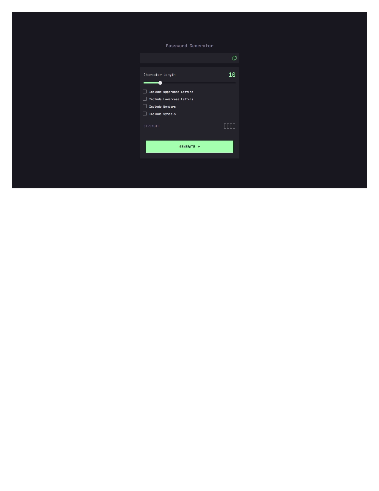
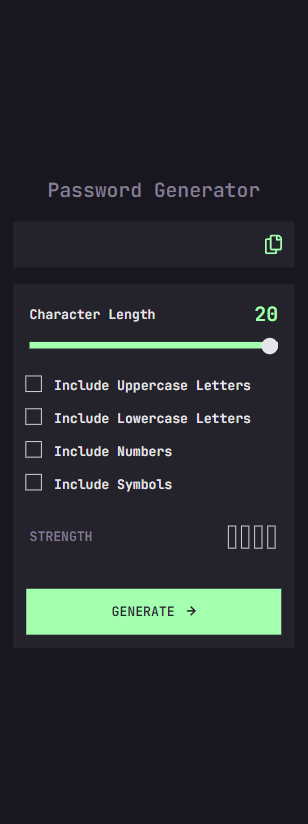

# Frontend Mentor - Password generator app solution

This is a solution to the [Password generator app challenge on Frontend Mentor](https://www.frontendmentor.io/challenges/password-generator-app-Mr8CLycqjh). Frontend Mentor challenges help you improve your coding skills by building realistic projects.

## Table of contents

- [Overview](#overview)
  - [The challenge](#the-challenge)
  - [Screenshot](#screenshot)
  - [Links](#links)
- [My process](#my-process)
  - [Built with](#built-with)
  - [What I learned](#what-i-learned)
  - [Continued development](#continued-development)
  - [Useful resources](#useful-resources)
- [Author](#author)
- [Acknowledgments](#acknowledgments)

## Overview

### The challenge

Users should be able to:

- Generate a password based on the selected inclusion options
- Copy the generated password to the computer's clipboard
- See a strength rating for their generated password
- View the optimal layout for the interface depending on their device's screen size
- See hover and focus states for all interactive elements on the page

### Screenshot

### Links

- Solution URL: [Github Solution](https://github.com/dors001/password-generator)
- Live Site URL: [Password Generator Live URL](https://password-generator-five-roan.vercel.app/)

## My process

### Built with

- CSS custom properties
- Flexbox
- CSS Grid
- [React](https://reactjs.org/) - JS library
- [Bootstrap](https://getbootstrap.com/) - For styles

### What I learned

This project thought me a lot more about using CSS tricks to calculate and design the assets that i need for the assignment.
There were some logical tricks that i needed to figure about about the password generating flow and it was worth while because it opened my mind to new ways i can tackle an issue.
In summary it was a fun, short project that showed me how i progressed through the year with react.

### Continued development

Next on the agenda is to learn caching and routing in order to create a more extensive websites.

## Author

- Frontend Mentor - [@dors001](https://www.frontendmentor.io/profile/dors001)
